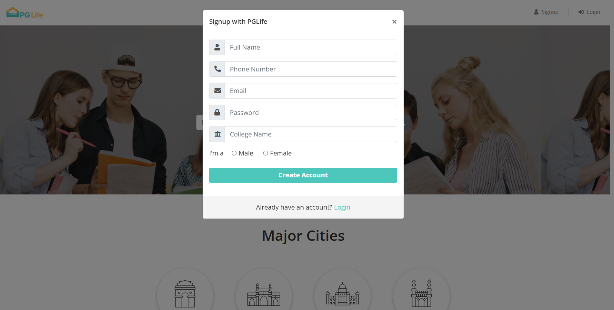
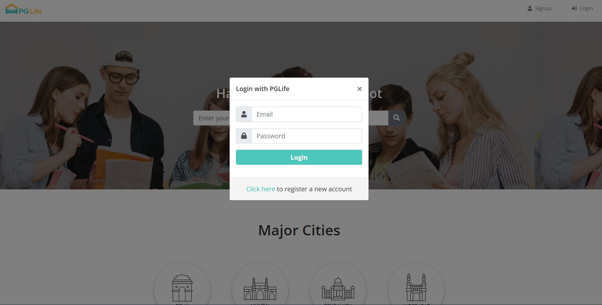
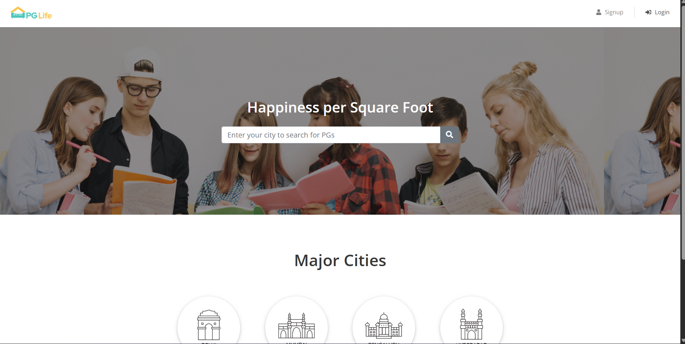
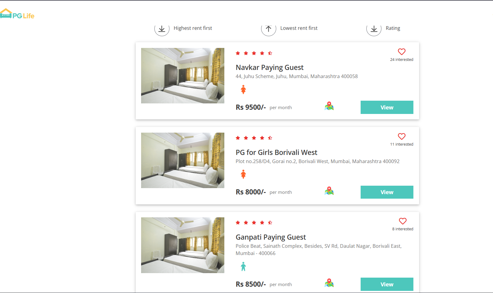
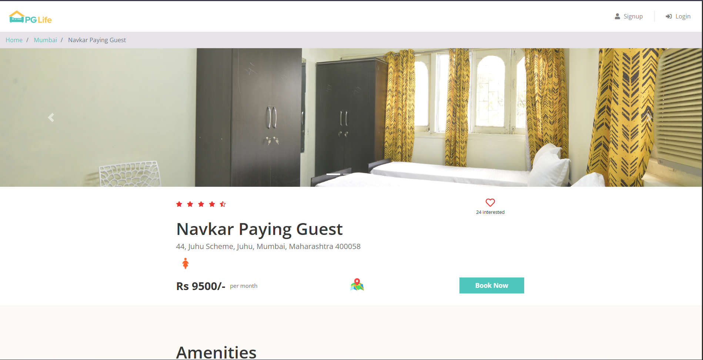

## 🏠 PG Life — Full Stack Web Application

A full-stack web application that helps students and working professionals find, compare, and shortlist PG accommodations across major Indian cities.

## 📌 About the Project

PG Life is a PHP & MySQL-based web portal developed as part of an internship project at JECRC University, Jaipur.

Finding accommodation in a new city can be overwhelming — this platform simplifies the process by offering a centralized system to:

Search PGs by city,
View detailed property information,
Filter and sort listings,
Save favorite properties

## ✨ Features

👤 For Users (Students)

🔍 City-wise Search — Search PGs by city (Delhi, Mumbai, Bengaluru, Hyderabad)

🏠 Property Listings — View rent, gender type, ratings, and address

📄 Property Details Page — Images, amenities, ratings, testimonials

❤️ Wishlist Feature — Save properties (AJAX-based, no reload)

👤 User Dashboard — View profile and saved properties

🔐 Authentication System — Signup/Login with session management

🔽 Filter & Sort — Sort by rent, filter by gender

🛡️ For Admin - (IN PROGRESS)

🔐 Secure Admin Login (session-protected),
📊 Dashboard with real-time stats,
➕ Add new properties (images + amenities),
✏️ Edit existing properties,
🗑️ Delete properties (DB + images),
🔎 Search & filter listings

## 🖼️ Screenshots

## Signup Page

## Login Page

## Home Page

## Property Listings

## Details Page

